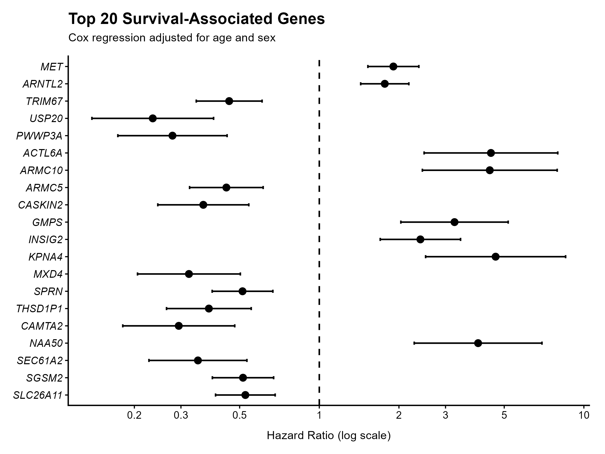
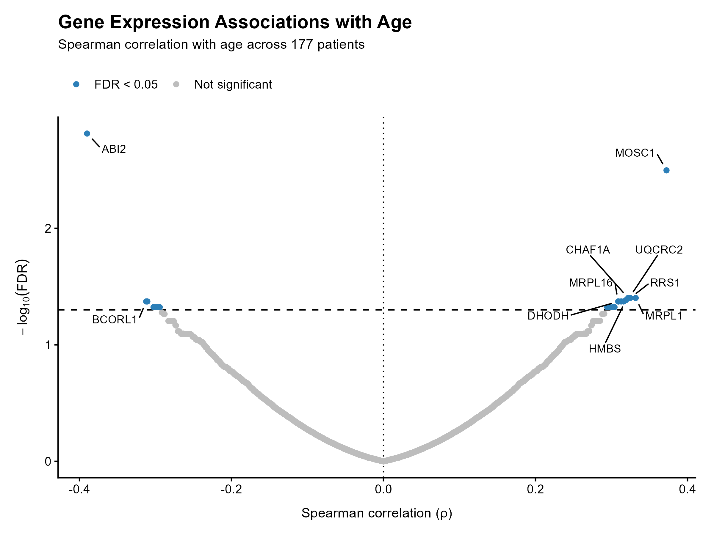
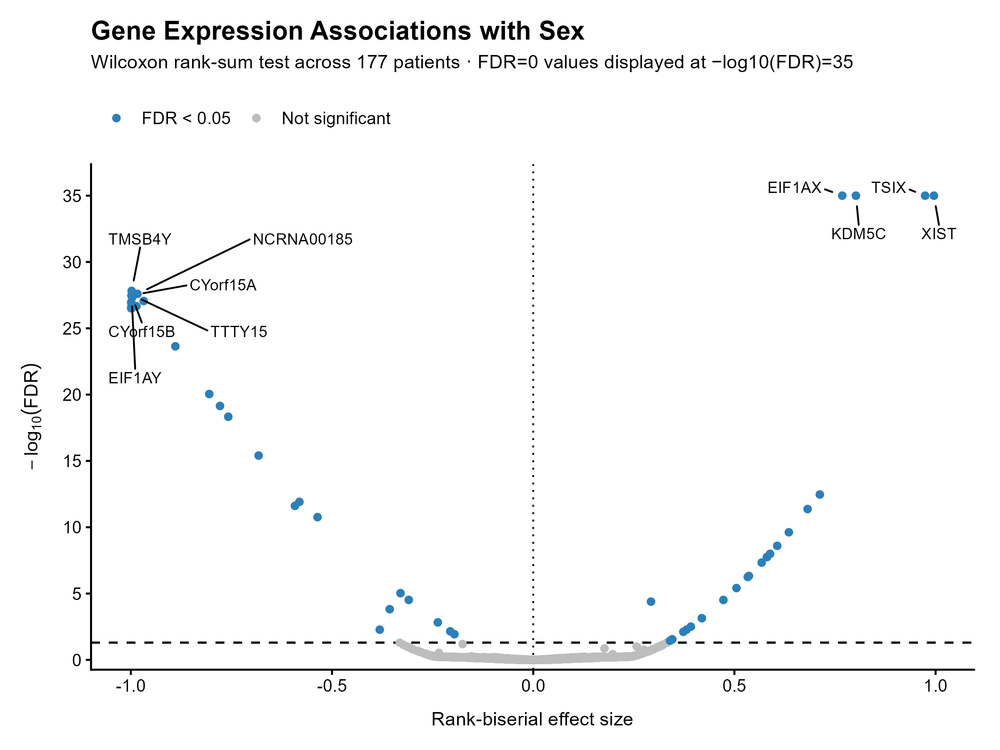
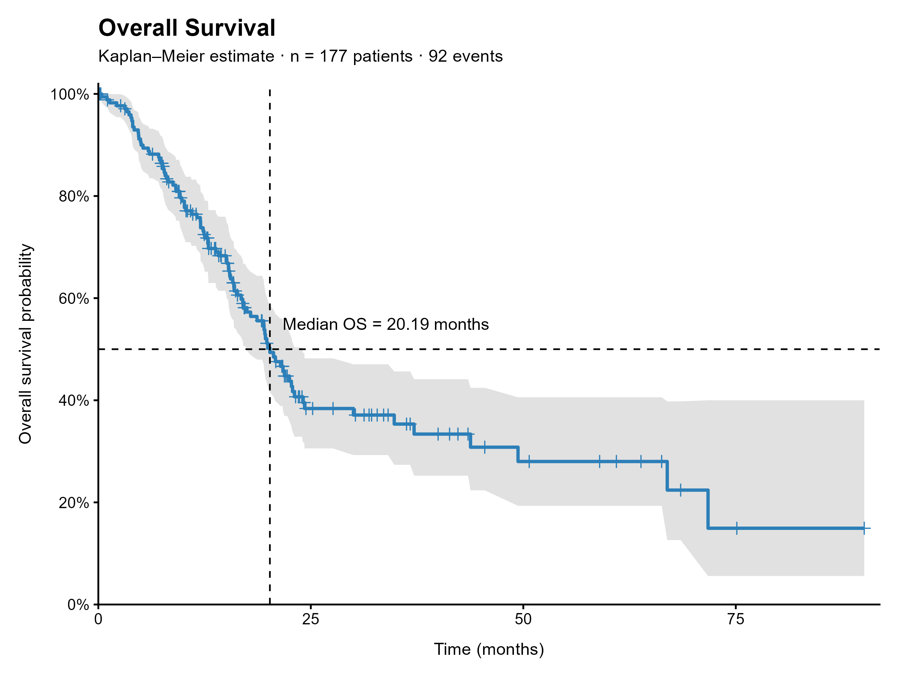

# Clinical–Molecular Integration in Pancreatic Adenocarcinoma

## Key findings

- The integrated cohort included **177 patients** with matched clinical and RNA-seq data.
- **28 genes** showed significant associations with age after Benjamini–Hochberg false-discovery-rate correction (`FDR < 0.05`).
- **54 genes** showed significant associations with sex after FDR correction.
- Overall-survival analysis included **177 patients and 92 observed deaths**, with a median overall survival of **20.19 months**.
- Gene-wise Cox regression identified widespread associations between gene expression and overall survival. After adjustment for age and sex, **3,532 genes** remained significant at `FDR < 0.05`.
- Among the strongest adjusted survival associations were **MET, ARNTL2, TRIM67, USP20, and PWWP3A**.
- Proportional-hazards diagnostics for the top 20 adjusted survival candidates showed **no evidence of violation of the proportional-hazards assumption**.

## Project overview

This project integrates transcriptomic gene-expression data with clinical characteristics and overall-survival information in pancreatic adenocarcinoma.

**Data source:** cBioPortal — Pancreatic Adenocarcinoma (TCGA, PanCancer Atlas)  
**Study ID:** `paad_tcga_pan_can_atlas_2018`

### Research question

> Is gene expression associated with clinical characteristics and patient survival in a pancreatic adenocarcinoma cohort?

The analysis focuses on gene-level associations with age, sex, and overall survival, including survival models adjusted for age and sex.

## Cohort

- Integrated samples: **177**
- Genes/features after preprocessing: **19,127**
- Overall-survival events: **92**
- Censored observations: **85**
- Female patients: **80**
- Male patients: **97**

Seven clinical samples lacked matching expression samples and were excluded from the integrated analysis.

## Analysis workflow

1. Clinical–molecular data integration
2. Expression quality control
3. Log2(x + 1) transformation
4. Low-detection gene filtering
5. Spearman association with age
6. Wilcoxon rank-sum association with sex
7. Kaplan–Meier overall-survival analysis
8. Gene-wise unadjusted Cox regression
9. Gene-wise Cox regression adjusted for age and sex
10. Benjamini–Hochberg false-discovery-rate correction
11. Proportional-hazards diagnostics
12. Reproducible figure generation

## Main results

### Gene expression and age

Gene-level associations with age were assessed using Spearman correlation across the 177-patient integrated cohort.

Among the 19,127 analyzed genes:

- **2,964 genes** had nominal `p < 0.05`
- **298 genes** had `FDR < 0.10`
- **28 genes** had `FDR < 0.05`

The strongest observed associations included negative correlation for **ABI2** and positive correlation for **MOSC1**.

These results describe statistical associations between gene expression and patient age and do not establish age-dependent regulatory mechanisms.

### Gene expression and sex

Expression differences between female and male patients were assessed using the Wilcoxon rank-sum test.

Among the 19,127 analyzed genes:

- **1,484 genes** had nominal `p < 0.05`
- **67 genes** had `FDR < 0.10`
- **54 genes** had `FDR < 0.05`

The strongest associations included several genes located on the X and Y chromosomes, including **EIF1AX, KDM5C, TSIX, XIST, TMSB4Y, EIF1AY, UTY, KDM5D,** and **ZFY**.

Effect sizes were summarized using rank-biserial correlation.

### Overall survival

Overall survival was analyzed for all 177 patients using Kaplan–Meier estimation.

- Patients: **177**
- Observed deaths: **92**
- Censored observations: **85**
- Median overall survival: **20.19 months**
- 95% CI for median survival: **17.5–24.1 months**

### Gene expression and survival

Gene-wise Cox proportional-hazards models were fitted using log2-transformed expression values.

The unadjusted analysis included all **19,127 genes**:

- **6,925 genes** had nominal `p < 0.05`
- **5,956 genes** had `FDR < 0.10`
- **4,202 genes** had `FDR < 0.05`

Hazard ratios represent the change in hazard associated with a one-unit increase in log2-transformed gene expression.

The unadjusted analysis is exploratory and does not account for clinical covariates.

### Survival associations adjusted for age and sex

A second gene-wise Cox analysis adjusted for patient age and sex:

```text
Surv(OS_MONTHS, OS_event) ~ expression + AGE + SEX
```

All **19,127 genes** were successfully analyzed.

After adjustment:

- **6,538 genes** had nominal `p < 0.05`
- **5,332 genes** had `FDR < 0.10`
- **3,532 genes** had `FDR < 0.05`

Among the strongest adjusted associations were:

| Gene | Hazard ratio |
|---|---:|
| MET | 1.91 |
| ARNTL2 | 1.77 |
| TRIM67 | 0.46 |
| USP20 | 0.23 |
| PWWP3A | 0.28 |

These hazard ratios describe observational associations with overall survival after adjustment for age and sex. They should not be interpreted as causal effects or as evidence of clinical utility.

### Proportional-hazards diagnostics

The proportional-hazards assumption was evaluated using `cox.zph` for the top 20 adjusted survival candidates.

No evidence of proportional-hazards violation was observed among these 20 candidates in the diagnostic analysis.

These diagnostics were applied to the selected top candidates rather than to all 19,127 gene-wise models.

## Main figures

### Figure 1 — Top 20 adjusted survival associations



Forest plot showing the top 20 survival-associated genes from Cox regression adjusted for age and sex.

### Figure 2 — Gene expression associations with age



Spearman correlations between gene expression and patient age across the integrated cohort.

### Figure 3 — Gene expression associations with sex



Gene-level associations with sex based on the Wilcoxon rank-sum test and rank-biserial effect size.

### Figure 4 — Overall survival



Kaplan–Meier estimate of overall survival for the integrated cohort.

## Methodological notes

Expression values were treated as continuous RSEM-like measurements. Downstream association and survival analyses used log2(x + 1)-transformed expression values.

Genes were retained when expression was detected in at least 10% of the 177 integrated samples.

Multiple-testing correction was performed using the Benjamini–Hochberg procedure.

Adjusted Cox hazard ratios describe associations with overall survival after adjustment for age and sex. They are observational associations and should not be interpreted as causal effects.

A stage-adjusted Cox analysis was explored but was not retained as a main analysis because the available stage distribution was highly imbalanced, with most patients concentrated in a single stage category.

## Repository structure

```text
clinical-molecular-integration/
├── data/
│   └── README.md
├── figures/
│   ├── Figure_1_top20_adjusted_cox_forest_plot.png
│   ├── Figure_2_age_expression_association.png
│   ├── Figure_3_sex_expression_association.png
│   └── Figure_4_overall_survival_KM.png
├── results/
│   └── tables/
├── scripts/
│   ├── 01_data_preparation.R
│   ├── 02_expression_processing.R
│   ├── 03_build_analysis_dataset.R
│   ├── 04_expression_clinical_integration.R
│   ├── 05_expression_preprocessing.R
│   └── 06_expression_clinical_association.R
├── .gitignore
├── LICENSE
└── README.md
```

Raw downloaded data and large intermediate analysis objects are excluded from version control through `.gitignore`.

## Reproducibility

The analysis is implemented as a sequence of R scripts.

- `01_data_preparation.R` prepares and summarizes the clinical cohort.
- `02_expression_processing.R` performs expression quality control.
- `03_build_analysis_dataset.R` constructs the integrated clinical dataset.
- `04_expression_clinical_integration.R` aligns molecular and clinical samples.
- `05_expression_preprocessing.R` performs transformation and low-detection filtering.
- `06_expression_clinical_association.R` performs the statistical analyses and generates the four main figures.

The final analysis script includes the statistical tests, multiple-testing correction, survival analyses, diagnostic procedures, and figure generation.

## Data source

**cBioPortal:** https://www.cbioportal.org/

**Study:** Pancreatic Adenocarcinoma (TCGA, PanCancer Atlas)

**Study ID:** `paad_tcga_pan_can_atlas_2018`

Raw source data and large intermediate objects are not included in this repository.

## Software

- R
- survival
- ggplot2
- ggrepel

## Interpretation and limitations

This repository contains an independent computational reanalysis of publicly available molecular and clinical data.

The analyses identify statistical associations between gene expression and clinical or survival variables. They do not establish causality, biological mechanism, or clinical utility.

The survival analysis is based on a single pancreatic adenocarcinoma cohort and should therefore be interpreted as exploratory. Findings would require validation in independent cohorts before being considered robust biomarkers or clinically relevant predictors.

The stage-adjusted survival analysis was not retained because of substantial imbalance in the available stage categories.

## Disclaimer

Findings presented in this repository are exploratory associations from a public-data reanalysis and are not intended to establish clinical utility, diagnostic or prognostic validity, or causal relationships.
